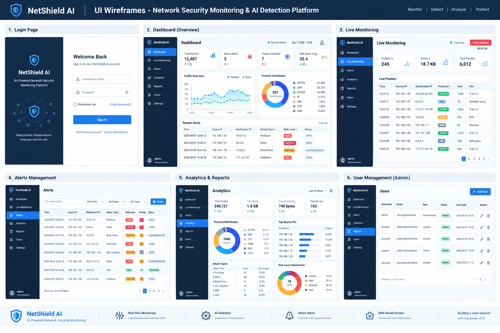

# NetShield AI - UI Wireframes

## Overview

The following wireframes define the planned user interface for the NetShield AI Network Anomaly Detection and Predictive Intrusion Monitoring Platform.

## Planned Screens

1. Login Page
2. Dashboard
3. Live Network Monitoring
4. Alerts Management
5. Analytics and Reports
6. User Management

These wireframes will serve as the visual reference for implementing the frontend application.